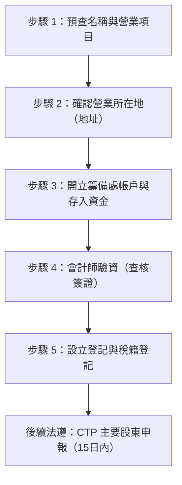

# 公司設立流程與實務指南

法規基準：2026/08 ｜ 公司法 §7、§9、§18、§22-1、§387、加值型及非加值型營業稅法 §28

---

## 案例基本設定（大葉園藝）

- **公司型態**：有限公司
- **經營項目**：景觀設計、花卉批發、園藝服務（代號 813000 / A301030 等）
- **股東結構**：股東 3 人
- **出資總額（資本額）**：新臺幣 5,000,000 元（500 萬元）
- **設立地址**：彰化縣花壇鄉

---

## 公司設立 5 大核心步驟（對齊 Q&A 實務流程）

| 步驟 | 階段名稱 | 客戶準備資料 | 會計師/事務所作業 | 法規依據與注意事項 |
|---|---|---|---|---|
| **①** | **確認名稱與營業項目（預查）** | 1. 3~5 個喜歡的公司名稱 2. 負責人身分證正反面影本 | 1. 向經濟部申請「公司名稱預查」 2. 登記園藝相關營業項目及 ZZ99999 概括條款 | **公司法 §18** - 預查核准保留 6 個月 - 政府預查原則 1 個工作天 - ⚠️ 若涉及種苗銷售需另申請「種苗業登記證」 |
| **②** | **確認營業所在地（地址）** | 1. 最新一期房屋稅單影本（或建物所有權狀） 2. 房屋租賃契約影本（自有免附） 3. 建物所有權人同意書 | 評估營業地址土地使用分區及建管規定 | **土地使用分區 / 建築法規** - 不需提供土地權狀 - 💡 **節稅眉角**：營業登記會使房東房屋稅/地價稅增加，可申請「1/6 面積供營業用」以降低稅負影響 |
| **③** | **開立籌備戶與存入資金** | 1. 拿名稱預查核准函與負責人私章 2. 親赴銀行開立「大葉園藝有限公司籌備處」帳戶 3. 由股東存入資本額（**500 萬元**） 4. 申請存款餘額證明或影印存摺封面與內頁 | 指導開戶與存入款項備查 | **金融法規與洗錢防制** - 資本額 500 萬須由股東名義如實匯入 - 避免他人代匯造成資金來源不清 |
| **④** | **會計師驗資（查核簽證）** | 提供銀行存款餘額證明、存摺影本、股東名冊、章程 | 會計師出具「資本額查核報告書」 | **公司法 §7、§9** - **公司法 §7**：設立應經會計師查核簽證 - **公司法 §9（刑事責任）**：嚴禁「借款過水」驗資！違者處 5 年以下有期徒刑、拘役或科或併科新臺幣 50 萬～250 萬元罰金 - ✅ **驗資完可以使用**：資金可用於公司正常營運（付租金、買設備、進貨），但每一筆花費皆須保留發票或收據憑證 |
| **⑤** | **設立登記與稅籍登記** | 備妥公司大小章（公司大章與負責人小章） | 1. 向縣市政府申請「公司設立登記」取得統編 2. 向國稅局申請「稅籍登記」 3. 申辦紙本統一發票購票證及電子發票資格 | **公司法 §387 / 營業稅法 §28** - 設立後 15 日內辦理稅籍登記 - 流程通常約 1～2 週完成 |

---

## 重要法遵：洗錢防制法 CTP 申報（主要股東申報）

- **法規依據**：**公司法 §22-1**（防制洗錢之實質受益人申報制度）
- **申報期限**：設立登記核准後 **15 日內** 必須上網申報董事及持股超過 10% 之主要股東資料。
- **罰則**：未依限申報或申報不實，主管機關可處 **新臺幣 5 萬元以上 500 萬元以下罰鍰**，限期未補正者得連續處罰至廢止公司登記！
- **實務建議**：流程非常簡單，具工商憑證即可自行上網免費申報；若委託會計師事務所代辦，市場行情約 **2,500 元**。

---

## 設立時程與費用標準

### 1. 辦理時間
- 名稱預查：約 1 個工作天
- 開戶與驗資：約 2~3 個工作天
- 政府審查登記：約 3~5 個工作天
- **完整流程通常約 1～2 週**。

### 2. 費用收費標準（彰化 500 萬、3 股東案）
| 項目 | 金額範圍 | 說明 |
|---|---|---|
| **政府規費** | 約 NT$1,100 | 名稱預查（網路 150 元）＋ 公司設立登記規費（網路申請減免按資本額 1/1000 減收） |
| **會計師資本額查核簽證** | 約 NT$4,000～7,000 | 500 萬資本額查核報告簽證費 |
| **公司設立代辦服務費** | 約 NT$8,000～20,000 | 包含章程擬定、表單送件、國稅局稅籍登記等代辦 |
| **CTP 主要股東申報（選配）** | 約 NT$2,500 | 亦可自行上網申報節省費用 |
| **刻章等雜費** | 約 NT$1,000～2,000 | 公司大章、負責人小章、發票章 |
| **顧問建議總預算** | **約 NT$15,000～28,000** | 完整包辦設立之建議預算 |

---

## 核心常見錯誤與問答重點

1. ❌ **迷思：驗資完錢不能動？**
   - ✅ **正確觀念**：驗資完當然可以動！但只能用於「公司營業用途」（付租金、買資材、裝潢、進貨），且必須留存合法發票或收據；切忌無憑證提領或匯回私人帳戶，避免構成公司法第 9 條之資本過水刑責。
2. ❌ **迷思：CTP 只是形式不用管？**
   - ✅ **正確觀念**：設立後 15 天內一定要申報，罰鍰高達 5 萬～500 萬元，務必列入核准後第一優先待辦事項。
3. ❌ **迷思：登記在自有住宅不用任何證明？**
   - ✅ **正確觀念**：即使是自有房產或親屬房屋，仍需檢附最新一期房屋稅單（或建物所有權狀影本）及屋主使用同意書。
