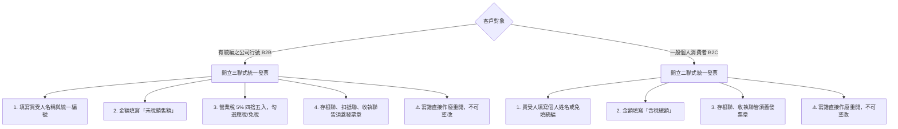

 401 vs 403 營業稅申報書比較與發票實務

法規依據：加值型及非加值型營業稅法 §8-1-19、§19、施行細則 §11、兼營營業人營業稅額計算辦法、統一發票使用辦法

---

## 核心觀念：先搞清楚營業人類型

| 營業人類型 | 業務型態說明 | 應使用申報書 |
|---|---|---|
| **專營應稅營業人** | 全數收入皆為應稅（如一般顧問公司、餐廳、科技業） | **401 申報書** |
| **專營免稅營業人** | 全數收入皆為免稅（如純賣生鮮農產品、飼料） | **403 申報書**（或經核准免申報） |
| **兼營營業人** | 同時有「應稅」及「免稅」銷售額（如園藝公司既賣生鮮切花又做割草綠化工程） | **403 申報書** |

> ⚠️ **大葉園藝定位**：既有生鮮花卉批發（免稅），又有景觀綠化服務（應稅），依法屬於**兼營營業人**，**必須使用 403 申報書**。
> 💡 **口訣**：「只要有免稅，一律四零三」

---

## 401 與 403 申報書差異對照表

| 比較維度 | 401 申報書 | 403 申報書 |
|---|---|---|
| **適用對象** | 專營應稅營業人 | 兼營營業人（應稅＋免稅）或專營免稅營業人 |
| **法規依據** | 營業稅法 §35 | 營業稅法施行細則 §11、兼營營業人營業稅額計算辦法 |
| **進項稅額扣抵** | 依法全額扣抵銷項稅額 | **不可全額扣抵**，需按「不得扣抵比例」分攤計算 |
| **分攤公式** | 無需分攤 | 不得扣抵比例 ＝ 免稅銷售額 ÷ 全部銷售額 |
| **年底調整機制** | 無需年度調整 | ✅ **年底最後一期（11-12月）必須辦理全年度進項比例總調整** |
| **申報時程** | 每 2 個月為 1 期，單數月 15 日前申報 | 每 2 個月為 1 期，單數月 15 日前申報 |
| **申報複雜度** | 填報銷項與進項即可 | 需區分應稅/免稅銷售額、計算不得扣抵進項與年度調整 |

---

## 發票開立實務（瓊月顧問提醒）

依據《統一發票使用辦法》，開立發票需依對象區分格式：

---

## 進項憑證檢核與申報時程提醒

### 1. 事務所資料提供時程
- 營業稅每 2 個月為 1 期，於**單數月 15 日前**申報。
- 客戶請務必於**單數月 8 日前**將當期進銷項憑證提供給事務所，以利核算申報書。

### 2. 進項發票檢核重點
1. **統編與抬頭**：確認記載公司正確統編與名稱。
2. **金額與稅額**：確認銷售額、稅額及總計無誤。
3. **發票章**：確認賣方有加蓋發票章。
4. **不可塗改**：塗改即屬無效憑證，須請廠商作廢重開。
