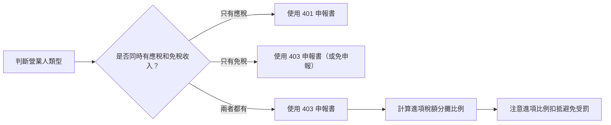

# 401 vs 403 營業稅申報書比較

法規依據：加值型及非加值型營業稅法、兼營營業人營業稅額計算辦法

---

## 核心觀念：先搞清楚你是哪一種營業人

| 類型 | 說明 | 使用申報書 |
|---|---|---|
| **專營應稅營業人** | 所有收入都是應稅的（如一般餐廳、科技公司） | **401** 申報書 |
| **專營免稅營業人** | 所有收入皆為免稅 | **403** 申報書（或向國稅局申請免申報） |
| **兼營營業人** | 同時有應稅＋免稅收入（如園藝公司賣花又做工程） | **403** 申報書 |

> ⚠️ **本案重點**：大葉園藝有花卉販售（免稅）和園藝維護服務（應稅），屬於**兼營營業人**，必須使用 **403 申報書**。

---

## 兩者差異比較

| 比較項目 | 401 申報書 | 403 申報書 |
|---|---|---|
| **適用對象** | 專營應稅或專營免稅營業人 | 兼營營業人（應稅＋免稅） |
| **進項稅額扣抵** | 全額扣抵（專營應稅）或全不可扣（專營免稅） | 需按比例分攤，部分不可扣抵 |
| **年度調整** | 不需要 | ✅ 年底最後一期必須做全年度比例調整 |
| **申報頻率** | 每兩個月（單數月 15 日前） | 每兩個月（單數月 15 日前） |
| **稅率** | 5%（應稅部分） | 5%（應稅部分），免稅部分 0% |
| **複雜度** | 較簡單 | 較複雜（需計算不可扣抵比例） |

---

## 常見錯誤

| ❌ 錯誤觀念 | ✅ 正確說明 |
|---|---|
| 「一般公司最常用 403」 | 大多數公司只有應稅收入，用的是 **401** |
| 「有免稅收入就不用申報營業稅」 | 兼營營業人仍需申報，且要用 **403** |
| 「401 和 403 只是編號不同，內容一樣」 | 403 多了免稅銷售額欄位和進項稅額分攤計算 |

---

## 申報流程差異圖

> 💡 **記憶口訣**：「只要有免稅，一律四零三」
