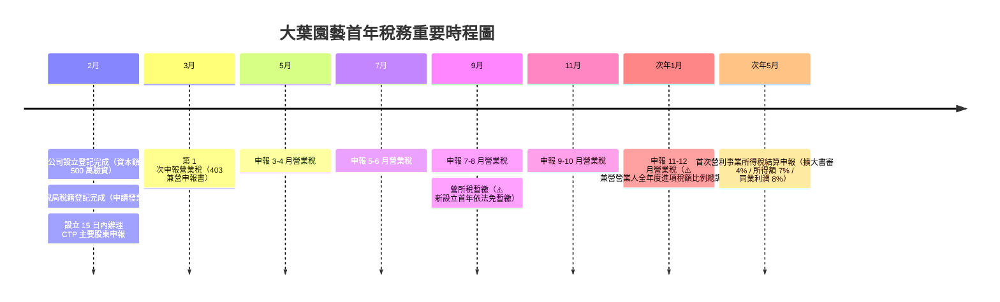
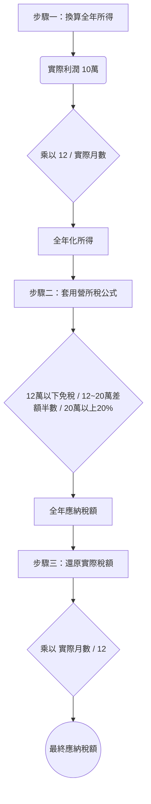

 首年稅務運作架構圖解

法規依據：公司法、營業稅法、所得稅法

> ⚠️ **此篇為全年度稅務運作架構與制度背景圖解，部分細節非本次 QA 簡報主線，僅供參考**

---

## 一、公司設立與首年稅務時間軸

---

## 二、四大稅務申報領域對照表

| 稅務主題 | 公司設立法遵 | 營業稅 (VAT) | 營利事業所得稅 (CIT) | 盈餘分配 (股東) |
|---|---|---|---|---|
| **核心計算基礎** | 資本額 5,000,000 元 | 營業收入（每筆銷售額） | 課稅所得額（全年淨利） | 稅後淨利扣除虧損與公積 |
| **主要法規** | 公司法 §7、§9、§22-1、§387 | 營業稅法 §8-1-19、§19、細則 §11 | 所得稅法 §5、§24、§39 | 所得稅法 §66-9、公司法 §237 |
| **申報申辦頻率** | 設立一次性（CTP 設立 15 日內） | 每 2 個月一次（單數月 15 日前） | 每年 5 月結算申報（9月暫繳） | 每年 5 月併同營所稅申報 |
| **適用費率** | 規費約 1,100 元 | 應稅 5% / 免稅 0% | 綠化服務書審 4%、所得額 7%、同業 8% | 提列 10% 公積、未分配加徵 5% |
| **本案實務規範** | 驗資可用於營運但須留憑證；嚴禁借款過水 | 使用 **403 申報書**；年底全年度比例調整 | 首年 9 月免暫繳；所得 12 萬以下免稅 | 分配順序：彌補虧損 → 提列公積 → 分配股利 |

---

## 三、營所稅「首年全年化」計算圖解（實務補充）

> ⚠️ **此為所得稅法 §40 規定之背景補充，非簡報主線**

若公司於年中設立，計算營所稅時須先將利潤換算為全年所得後套用稅率，再依實際月數還原：

