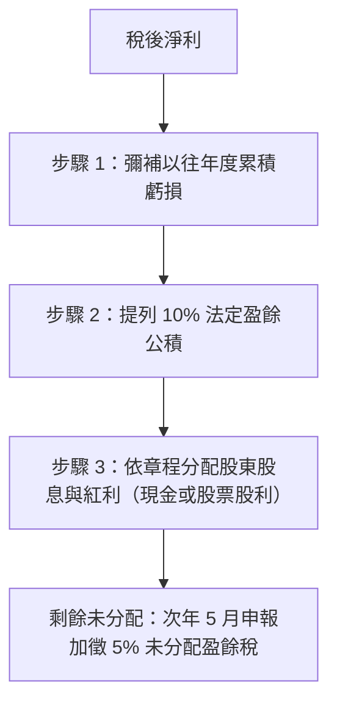

# 未分配盈餘與股東盈餘分配實務

法規依據：所得稅法 §66-9、公司法 §237、產業創新條例 §23-3

> ⚠️ **此內容不在本次簡報範圍，僅供進階參考**

---

## 一、稅後盈餘分配法定順序

公司每年度營利事業所得稅結算後，若有稅後盈餘，依《公司法》第 237 條規定，其分配必須依循法定順序：

$$\text{課稅所得額} - \text{營利事業所得稅} = \text{稅後淨利}$$

1. **彌補累積虧損**：以前年度如有虧損，應先以當年度稅後淨利全數彌補。
2. **提列 10% 法定盈餘公積**：彌補虧損後之餘額，依法應先提列 10% 作為法定盈餘公積（公積達資本額總額時得不再提列）。
3. **分配股利或保留**：其餘盈餘由股東會決議分配予股東，或保留於公司內部作為營運資金。

---

## 二、未分配盈餘加徵 5% 稅額機制（所得稅法 §66-9）

- **制度目的**：防止個人股東藉由將營利所得無限制保留於公司以規避個人綜合所得稅。
- **加徵規定**：公司當年度稅後淨利於次年年底前未分配者，應於次次年 5 月辦理營所稅結算申報時，就該未分配盈餘**加徵 5% 營利事業所得稅**。
- **實質投資租稅優惠（產創條例 §23-3）**：公司若以未分配盈餘於規定期限內進行實質投資（購置供自行生產或營業用之建物、軟硬體設備或技術），投資達一定金額門檻者，該投資金額可列為未分配盈餘之減除項目，免加徵 5% 稅額。

---

## 三、常見觀念澄清

1. ❌ **迷思：公司賺的錢老闆可以直接領去花？**
   - ✅ **正解**：公司是獨立法人，資金不能任意提領移作私用。股東要取得公司獲利，必須透過合法的「薪資發放」或「股利盈餘分配」管道。
2. ❌ **迷思：不分紅就完全不用管？**
   - ✅ **正解**：不分配盈餘雖然不計入個人綜合所得稅，但在次年 5 月結算時，公司必須依法申報並加徵 5% 未分配盈餘稅。
