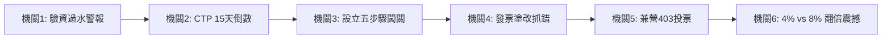

# 《大葉園藝設立與稅務實戰秀》沉浸式提案劇場導演手冊
### ——一場將「法規地雷」轉化為「互動攻防」的實務諮詢實境秀

> **核心目標**：告別傳統「照唸投影片」的單向報告，將整場簡報打造成「大葉園藝走進會計師事務所」的沉浸式諮詢實境劇場。
> **權威依據**：嚴格依據 `05_客戶QA預演.md`，聚焦 Q1(驗資)、Q2(CTP)、設立五步驟、設立實務補充、發票實務、營業稅兼營403、營所稅4%/7%/8%節稅四大核心模組。

---

## 一、演出形式概述（QA 互動式實境秀）

法規與稅務知識最怕枯燥與距離感。本場演出的核心設計理念是：**讓現場評審與同學在 30 秒內從「被動聽眾」化身為「事務所實習生與諮詢見證團」**。

* **場景設定**：拾穗聯合會計師事務所 貴賓諮詢室。
* **劇情主線**：彰化花壇的陳老闆帶著 500 萬創業夢想與滿腦袋實務疑問登門求助，事務所的「設立專家」德詮顧問與「稅務大師」瓊月顧問聯手接招，透過一問一答、道具展示與危機示警，逐一拆解驗資、CTP、流程、發票、兼營403與營所稅四大關卡。
* **互動核心**：每一次陳老闆提出危險想法（如過水抽資、塗改發票、忽略憑證），台下觀眾與顧問同步給予即時反饋，形成身歷其境的實務攻防。

---

## 二、角色設定與表演風格

| 角色 | 演員代表 | 角色設定與表演風格 | 核心任務與台詞特色 |
|:---|:---|:---|:---|
| 🧑‍🌾 **陳老闆** | 素麗 飾 | **大葉園藝創辦人**<br>熱情直爽、積極創業，但帶有坊間常見迷思（以為驗資完錢可隨意抽回、不知 CTP 罰責、想塗改發票、搞不懂兼營與稅率）。 | • 代表客戶提出最真實的痛點與疑問。<br>• 語氣自然、表情生動、時而恍然大悟。<br>• 關鍵台詞：「驗資完錢能直接領嗎？」「CTP是什麼？」「發票寫錯塗改不行嗎？」 |
| 🧑‍💼 **德詮顧問** | 用戶本人 飾 | **公司設立與法規合規專家**<br>沉穩冷靜、條理分明、法規權威。專精於資本額驗資、防制洗錢 CTP、設立流程與地址規劃。 | • 主答 Q1(驗資)、Q2(CTP)、設立五步驟、設立實務補充。<br>• 語氣自信從容、數字精準、金句連發。<br>• 關鍵數字：500萬、15天、罰5萬到500萬、1.5~2.8萬、2,500元、1/6營業面積。 |
| 👩‍💼 **瓊月顧問** | 瓊月 飾 | **稅務規劃與會計實務專家**<br>細緻溫暖、精準幹練。擅長將複雜繁瑣的發票規則與稅額算式轉化為淺顯易懂的生活大白話。 | • 主答發票開立實務、營業稅申報與兼營403、營所稅計算與三大標準比較。<br>• 語氣清晰親切、注重細節規範與憑證完整。<br>• 關鍵數字：單數月15日/8日、403申報書、書審4%、所得額7%、同業利潤8%、稅率20%。 |

---

## 三、互動機關設計（對齊新題目）

為使報告高潮迭起且深植人心，設計了 6 個低成本、高張力的實體互動機關：



### 機關 1｜驗資過水「風險警報器」
* **觸發時機**：陳老闆詢問「驗資完能不能先把 500 萬領出來還朋友」時。
* **機關動作**：德詮顧問或控場組員立刻按下手機警報音效（或拍桌示警），全場一起齊聲喊出：**「NO！！」**
* **效果**：瞬間抓住全場注意力，強化《公司法》第 9 條「資本額不實/過水可處 5 年徒刑」的法律震撼力。

### 機關 2｜CTP 15 天倒數計時大字報
* **觸發時機**：德詮顧問說明 CTP 申報時。
* **機關動作**：德詮顧問亮出寫著紅字「**15 天倒數計時！漏報最高罰 500 萬！**」的警示板。
* **效果**：將洗錢防制法規具象化為倒數炸彈，提醒大家設立登記後 15 天內的申報急迫性。

### 機關 3｜設立五步驟「通關大字報」
* **觸發時機**：德詮顧問講解設立流程時。
* **機關動作**：依序翻開五張彩色進度卡（①名稱預查 → ②地址確認 → ③開籌備戶存入500萬 → ④會計師驗資 → ⑤設立與稅籍登記），最後亮出「**最優先 3 件事：名稱、地址、身分證**」。
* **效果**：流程圖像化，打破文字死板條列，讓觀眾一眼掌握創業通關地圖。

### 機關 4｜發票塗改「大家來找碴」
* **觸發時機**：瓊月顧問講解發票開立注意事項時。
* **機關動作**：瓊月顧問拿出一張用立可帶塗改金額的放大版發票道具，問台下：「這張發票能不能拿去報帳？」全場觀眾大喊：「不行！」
* **效果**：強化「發票有錯一律整張作廢重開，嚴禁塗改」的實務鐵則。

### 機關 5｜403 兼營申報「舉手公投」
* **觸發時機**：瓊月顧問講解園藝業營業稅時。
* **機關動作**：瓊月顧問提問：「大葉園藝賣未加工花卉是免稅，做景觀工程是應稅，那申報營業稅要填 401 還是 403？」邀請現場舉手表決，隨後揭曉「**只要有免稅收入，一律用 403 兼營申報書！**」
* **效果**：將兼營營業人的核心考點轉化為全場參與的競猜遊戲。

### 機關 6｜書審 4% vs 同業 8% 翻倍震撼牌
* **觸發時機**：瓊月顧問講解營所稅三大申報方式時。
* **機關動作**：翻開對比牌，一面寫「擴大書審 4%（合規留憑證）」，另一面翻轉為「同業利潤標準 8%（抽查無憑證逕決）」，展示所得與稅額直接翻倍的強烈對比。
* **效果**：深刻傳達「擴大書審仍會抽查，平日必須張張保留發票憑證」的底層邏輯。

---

## 四、道具清單（低成本、高效益、一眼看懂）

| 道具名稱 | 規格/形式 | 用途與出場合身 | 取得/製作方式 |
|:---|:---|:---|:---|
| **出資 500 萬存摺/信封袋** | 牛皮紙袋或特大存摺道具，印有「資本額 5,000,000」 | 開場與 Q1 驗資時陳老闆手持，象徵創業資金 | 隨手牛皮紙袋加奇異筆大字 |
| **CTP 15 天倒數警示卡** | A4 紅底黑字卡，寫「15天倒數 / 罰 5 萬 ~ 500 萬」 | Q2 講解 CTP 洗錢防制法規時展示 | 列印或手繪 A4 硬紙板 |
| **設立流程五步驟闖關卡** | 5 張 A4 彩色字卡（預查/地址/籌備戶/驗資/登記） | 德詮講解設立五步驟時依序揭示 | 彩色厚紙板手寫/列印 |
| **發票展示道具（含塗改示範）** | 放大版三聯式發票、二聯式發票（一張塗改立可帶） | 瓊月講解發票開立與進貨檢核時展示 | A4 放大影印發票樣張 |
| **403 兼營申報書大字卡** | A4 醒目字卡，標註「403 兼營申報」與「免稅 ÷ 全部」 | 瓊月講解兼營營業稅時舉牌展示 | A4 護貝紙卡 |
| **營所稅費率震撼對比牌** | 雙面牌（正面 4% 書審，背面 8% 同業利潤翻倍） | 瓊月講解營所稅節稅與抽查風險時翻轉展示 | A4 紙板製作雙面牌 |
| **手機警報音效** | 短音效（消防警報 / 答錯嗶嗶聲，約 2-3 秒） | 陳老闆提出違規想法時播放 | 手機音效 App 或內建鈴聲 |
| **大葉園藝委任合約書** | 夾於有質感的簽約夾中之 A4 合約樣張 | 結尾總結時陳老闆正式簽約委任 | A4 列印合約樣張 |

---

## 五、場景與節奏安排（標準 12~15 分鐘模組）

```mermaid
gantt
    title 實戰演出節奏時間軸 (共 13 分鐘)
    dateFormat  m:s
    axisFormat  %M:%S
    開場諮詢與現況盤點       :done, a1, 00:00, 01:30
    第一幕: Q1驗資攻防       :done, a2, 01:30, 03:00
    第二幕: Q2 CTP申報       :done, a3, 03:00, 04:30
    第三幕: 設立五步驟主講   :done, a4, 04:30, 07:00
    第四幕: 德詮實務補充     :done, a5, 07:00, 09:00
    第五幕: 發票實務檢核     :done, a6, 09:00, 10:30
    第六幕: 營業稅與兼營403  :done, a7, 10:30, 12:00
    第七幕: 營所稅與節稅     :done, a8, 12:00, 13:30
    結尾: 總結簽約與Q&A      :done, a9, 13:30, 15:00
```

### 節奏控制總表

| 幕別 | 內容焦點 | 核心台詞/動作 | 建議時間 |
|:---|:---|:---|:---:|
| **開場** | 彰化花壇創業背景盤點 | 陳老闆帶 500 萬進場，德詮、瓊月熱情接待 | 1.5 分鐘 |
| **第一幕** | Q1 驗資合法營運 vs 借款過水 | 警報響起，德詮解析公司法 §9 刑責 | 1.5 分鐘 |
| **第二幕** | Q2 CTP 15日洗錢防制申報 | 亮出 15 天倒數牌，說明 5 萬~500 萬罰鍰 | 1.5 分鐘 |
| **第三幕** | 設立流程五步驟闖關 | 德詮展示五步驟字卡，點出最優先 3 件事 | 2.5 分鐘 |
| **第四幕** | 設立實務補充（收費/代辦/地址） | 1.5~2.8 萬預算、CTP代辦 2,500、1/6 地址節稅 | 2.0 分鐘 |
| **第五幕** | 發票開立實務與進貨檢核 | 三聯/二聯發票展示、嚴禁塗改、進貨 4 大檢核 | 1.5 分鐘 |
| **第六幕** | 營業稅申報與兼營 403 | 單數月 15 日申報/8 日送件、403 免稅比例扣抵 | 1.5 分鐘 |
| **第七幕** | 營所稅計算與節稅三大標準 | 課稅所得公式、級距、書審 4% vs 同業 8% 翻倍 | 1.5 分鐘 |
| **結尾** | 總結守護、簽約儀式與現場 Q&A | 陳老闆滿意簽約，三人鞠躬，開放問答 | 1.5 分鐘 |

---

## 六、備案與應變機制

1. **若報告時間壓縮至 10 分鐘以內**：
   * 簡化第三幕設立流程五步驟，直接聚焦「最優先準備 3 件事」。
   * 第四幕收費與代辦快速帶過，重點保留「1/6 營業地址節稅」。
   * 互動機關保留「機關 1 驗資過水」與「機關 6 書審 4% vs 8% 翻倍」，其餘口頭帶過。
2. **若現場無音效設備**：
   * 改以顧問「手勢暫停 + 拍桌」或「口頭喊嗶嗶」代替電子警報音效。
3. **忘詞應變原則**：
   * 德詮忘詞：瓊月以「德詮顧問剛才提到的重點是...」順勢遞話。
   * 瓊月忘詞：德詮以「在稅務方面，瓊月顧問最常提醒老闆的就是...」接招。
   * 陳老闆自由發揮：只要圍繞「這筆錢能用嗎？」「要繳多少稅？」「會不會被罰？」提問，顧問皆可自然接招。

---

**導演總結**：整場演出的靈魂在於「專業與幽默並重、條理與互動兼具」。透過精準的角色分工與生動的道具機關，將 `05_客戶QA預演.md` 的所有知識點轉化為一場讓人拍案叫絕的顧問實戰大秀！
