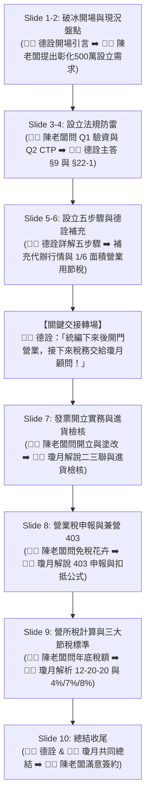

 06_三人角色分配

> 本分配表專為大葉園藝有限公司設立與稅務諮詢提案設計，以 `05_客戶QA預演.md` 為唯一權威劇本。

---

## 1. 角色定位總覽

| 角色 | 定位 | 負責內容重點 | 適合特質 / 演出建議 |
| :--- | :--- | :--- | :--- |
| 🧑‍🌾 **陳老闆（客戶）** | 提問者・反應者 | 全程提問，提出園藝創業需求，表達老闆常見疑慮與誤解 | 素麗（活潑、敢演、表情生動） |
| 🧑‍💼 **德詮顧問** | 設立類主答・引導者 | Q1 驗資法令、Q2 CTP 申報、設立流程五步驟、德詮彰化實務補充 | 用戶本人（對流程最熟悉、節奏掌控者） |
| 👩‍💼 **瓊月顧問** | 稅務類主答・數字擔當 | 發票開立二三聯、不可塗改鐵則、兼營 403 營業稅、營所稅 12-20-20 與 4%/7%/8% 節稅 | 瓊月（細心、對稅務公式與數字有把握） |

---

## 2. 上場流程圖

---

## 3. 各角色完整劇本與台詞對照表

### 第一階段：開場導入與設立防雷 (Slide 1 ~ 4)

| 序號 | 發言角色 | 核心台詞與情境表現 | 答題重點 / 舞台動作 |
| :---: | :--- | :--- | :--- |
| 1 | 🧑‍💼 **德詮顧問** | 「陳老闆您好！恭喜您邁出創業的重要一步，想將家族園藝事業正式立案為大葉園藝有限公司。我們團隊今天會為您把關所有設立與後續稅務流程！」 | 親切微笑、引導進入諮詢情境 |
| 2 | 🧑‍🌾 **陳老闆** | 「會計師您好！我們在彰化花壇做園藝很久了，這次找了 3 位股東合資 500 萬想開公司。首先我想問：**驗資完之後，這筆 500 萬我能直接領出來用嗎？**」 | 帶著好奇與精明神情拋出 Q1 |
| 3 | 🧑‍💼 **德詮顧問** | 「**老闆，驗資完的錢當然可以拿來用！** 不過這筆錢只能用在『公司營運』上，例如付租金、買設備或進貨。千萬不能沒有憑證就直接領出來放回自己口袋喔，不然主管機關會認為是『借款過水』，依公司法 §9 最重有 5 年刑責。每一筆花費我們都要留好發票或收據！」 | 語氣堅定專業，強調營運可用但絕不可過水 |
| 4 | 🧑‍🌾 **陳老闆** | 「原來是這樣！那另外我聽說設立公司有什麼 **CTP 申報**，那是幹嘛的？沒報會怎樣？」 | 露出疑惑表情拋出 Q2 |
| 5 | 🧑‍💼 **德詮顧問** | 「那是防制洗錢的『主要股東申報』(CTP)，規定設立後 **15 天內**一定要上網申報公司的董事和主要股東資料。這個很重要喔！如果不報，政府是可以罰 **5 萬到 500 萬**的，甚至可以廢止公司登記。您放心，這部分我們設立時會幫您把關！」 | 強化 15 天與 5 萬 ~ 500 萬罰款 |

---

### 第二階段：設立五步驟與德詮實務補充 (Slide 5 ~ 6)

| 序號 | 發言角色 | 核心台詞與情境表現 | 答題重點 / 舞台動作 |
| :---: | :--- | :--- | :--- |
| 6 | 🧑‍🌾 **陳老闆** | 「那設立這間園藝公司，整體流程到底要怎麼走？我們需要準備什麼？」 | 表達想了解具體步驟 |
| 7 | 🧑‍💼 **德詮顧問** | 「設立園藝公司主要有清楚的五大步驟： ① **確認名稱與營業項目（預查）**：提供 3~5 個名稱與身分證影本，登記花卉批發、零售或園藝服務。 ② **確認營業所在地（地址）**：準備租約、房屋稅單及屋主同意書，我們會評估土地使用分區及建管規定。 ③ **開立籌備戶與入資**：親赴銀行開立籌備處帳戶，匯入 500 萬資本額並取得存款證明。 ④ **會計師驗資**：由會計師出具資本額查核報告書。 ⑤ **縣市政府與國稅局登記**：取得統編、稅籍登記與統一發票購票證。 您只要備妥名稱、地址和身分證，我們就能立刻啟動！」 | 搭配投影片手勢清晰解說五步驟 |
| 8 | 🧑‍🌾 **陳老闆** | 「我們在彰化花壇、3 位股東、出資 500 萬，大約要多久？費用怎麼算？CTP 一定要找代辦嗎？地址租的房東怕稅金變貴怎麼辦？」 | 連續拋出實務問題 |
| 9 | 🧑‍💼 **德詮顧問** | 「針對彰化案件我特別補充三點實務： ① **時程與費用**：預查 1 天、全流程約 1~2 週。規費約 1,100 元、簽證 4,000~7,000 元、代辦 8,000~20,000 元，建議總計抓 **1.5～2.8 萬元**。 ② **CTP 代辦**：流程簡單可持工商憑證自行申報省錢；委託事務所代辦行情約 **2,500 元**。 ③ **地址節稅**：租用地址可向稅捐處申請**『1/6 面積供營業用』**，只有六分之一面積變更稅率，其餘維持自用住宅稅率，房東最容易同意！」 | 清楚交代 1.5~2.8 萬、2,500 元與 1/6 面積技巧 |

---

### 【關鍵轉場】：德詮顧問交棒給瓊月顧問

> 🧑‍💼 **德詮顧問**：
> 「拿到統一編號和購票證後，大葉園藝就正式開門營業了！接下來公司日常營運中最核心的發票開立、每兩個月的營業稅申報，以及年底營所稅合法節稅秘訣，由我們最專業的稅務顧問瓊月來為陳老闆詳細解說！」

---

### 第三階段：發票開立實務與進貨檢核 (Slide 7)

| 序號 | 發言角色 | 核心台詞與情境表現 | 答題重點 / 舞台動作 |
| :---: | :--- | :--- | :--- |
| 10 | 🧑‍🌾 **陳老闆** | 「瓊月顧問您好！我們開始賣花、做庭園維護，發票要怎麼開？三聯跟二聯差在哪？寫錯可以直接塗改嗎？進貨發票要看什麼？」 | 熱情轉向瓊月顧問請教 |
| 11 | 👩‍💼 **瓊月顧問** | 「陳老闆您好！開立發票依對象區分： ① **三聯式（開給公司/營業人）**：填寫買方統編，金額填『銷售額（未稅）』，加 5% 營業稅，存根聯、扣抵聯、收執聯**三聯皆須蓋發票章**。 ② **二聯式（開給一般個人消費者）**：金額直接填『含稅價』，存根聯與收執聯蓋章。 ⚠️ **發票鐵則**：開錯發票**絕對不可塗改**，必須整張作廢重開！ 另外，收到進貨發票請檢核：統編是否正確、銷售額與稅額是否正確、是否有蓋發票章、且不可有任何塗改！」 | 語調清晰，手勢強調「絕對不可塗改」 |

---

### 第四階段：營業稅申報與兼營 403 (Slide 8)

| 序號 | 發言角色 | 核心台詞與情境表現 | 答題重點 / 舞台動作 |
| :---: | :--- | :--- | :--- |
| 12 | 🧑‍🌾 **陳老闆** | 「我們賣生鮮花卉不用稅，但又有接景觀工程要繳稅，每兩個月報營業稅要怎麼報？什麼時候要把資料給你們？」 | 表達對免稅+應稅兼營的困惑 |
| 13 | 👩‍💼 **瓊月顧問** | 「營業稅每 2 個月為 1 期，於單數月 15 日前申報，請陳老闆在**單數月 8 日前**把銷項發票、進項發票、水電單及折讓單提供給我們。 園藝業最關鍵的是：**只要有免稅收入，一律要使用 403 申報書！** 計算公式為：銷項稅額 − 進項稅額 − 上期留抵 ＝ 應納稅額。 兼營的不得扣抵比例為：$$\text{不得扣抵比例} = \frac{\text{免稅收入}}{\text{全部收入}}$$ 另外，老闆私人的交際應酬、自用小客車憑證不能拿來抵營業稅，我們都會幫您分類把關！」 | 說明單數月 8 日前送件、403 申報書與扣抵公式 |

---

### 第五階段：營所稅計算與節稅策略 (Slide 9)

| 序號 | 發言角色 | 核心台詞與情境表現 | 答題重點 / 舞台動作 |
| :---: | :--- | :--- | :--- |
| 14 | 🧑‍🌾 **陳老闆** | 「到了年底營所稅，我們到底要繳多少稅？要怎麼合法節稅？書審是不是就不用留發票了？」 | 關心年底稅金支出與節稅技巧 |
| 15 | 👩‍💼 **瓊月顧問** | 「營所稅是按整年課稅所得計算，級距為 **12 萬以下免稅、12~20 萬減半、超過 20 萬稅率 20%**。 針對園藝綠化服務業（114年度），有三大申報標準： ① **擴大書審（4%）**：營業額 3,000 萬以內適用，純益率只要 4%，最簡便省稅！ ② **所得額標準（7%）**：營業額 3,000 萬以上適用。 ③ **同業利潤標準（8%）**：被國稅局抽查帳證不全時逕行核定。 ⚠️ 特別提醒：書審雖然省事，但**絕不能不留憑證**！如果被國稅局抽查拿不出帳冊，會被改按同業利潤標準 8% 補稅，稅金直接加倍！有我們把關，平時憑證做齊，既享 4% 書審優惠，又無後顧之憂！」 | 精準展示 12-20-20 與 4%/7%/8% 關鍵數字 |

---

### 第六階段：總結收尾 (Slide 10)

| 序號 | 發言角色 | 核心台詞與情境表現 | 答題重點 / 舞台動作 |
| :---: | :--- | :--- | :--- |
| 16 | 🧑‍💼 **德詮顧問** | 「所以陳老闆，從開公司的驗資、CTP、五步驟，到後續的發票、營業稅 403 與營所稅書審節稅，我們事務所提供全方位一條龍服務。」 | 展現專業自信 |
| 17 | 👩‍💼 **瓊月顧問** | 「開公司就像培育精品盆栽，細心修剪、合法合規才能長久繁茂。稅務地雷交給我們，您專心拓展園藝事業！」 | 溫暖收尾 |
| 18 | 🧑‍🌾 **陳老闆** | 「太清楚了！有你們兩位專業顧問把關，我就完全放心了，我們立刻來簽約啟動！」 | 滿意點頭、圓滿結束 |

---

## 4. 準備重點與演繹技巧

### 🧑‍🌾 陳老闆（素麗）
- **心態**：放下背法規的壓力，當作自己就是一位精明、想創業的園藝老闆。
- **技巧**：記住 6 個發問時機（Q1驗資 ➡️ Q2 CTP ➡️ 設立流程 ➡️ 彰化實務 ➡️ 發票二三聯 ➡️ 營業稅403 ➡️ 營所稅節稅），提問時語氣自然生動。
- **反應**：聽到罰 500 萬時表現出驚訝，聽到 1/6 面積節稅與 4% 書審時表現出恍然大悟。

### 🧑‍💼 德詮顧問（用戶本人）
- **心態**：全場節奏的主導者與控場者。
- **技巧**：熟記設立五步驟、公司法 §9 與 §22-1 罰則、彰化收費區間（1.5~2.8 萬）與 1/6 面積技巧。在第 9 序號講完後，順暢、熱情地將發言權轉交給瓊月顧問。

### 👩‍💼 瓊月顧問（瓊月）
- **心態**：嚴謹、專業、值得信賴的稅務專家。
- **技巧**：熟記核心數字與口訣：
  - 發票：三聯未稅、二聯含稅、**不可塗改**。
  - 營業稅：單數月 8 日送件/15 日申報、**兼營一律 403**、不得扣抵比例 ＝ 免稅÷全部。
  - 營所稅：**12萬免、12~20萬減半、20萬20%**；114年度綠化服務「**書審 4%、所得 7%、同業 8%**」。

---

## 5. 給兩位姊姊的選擇說明

> 兩位姊姊可以根據自己的喜好與風格挑選最舒適的角色：
> - **喜歡演戲、不想背複雜法規 ➡️ 選擇 🧑‍🌾 陳老闆（素麗）**：只要自然提問、適時給出驚訝或點頭反應，是全場帶動氣氛的靈魂人物！
> - **細心、對數字與稅務條理有把握 ➡️ 選擇 👩‍💼 瓊月顧問（瓊月）**：負責講解發票、營業稅與營所稅節稅，展現事務所最專業沉穩的稅務實力！
